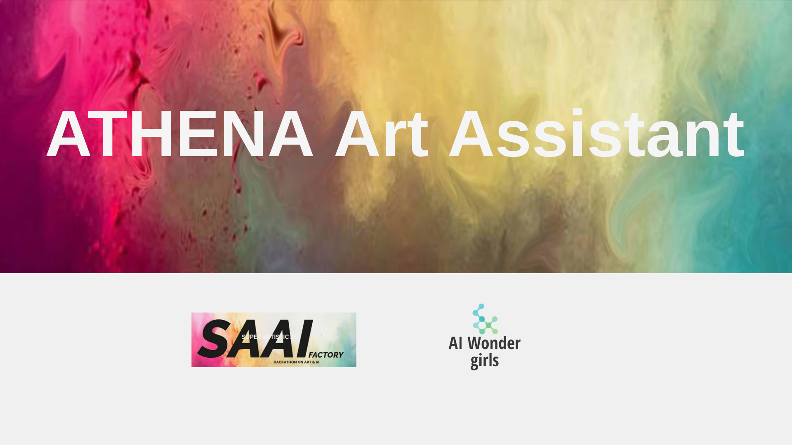
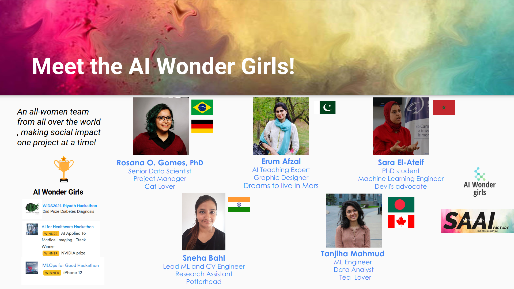

# SAAI AI & Art Hackathon

Find out more about this project at its [Devpost page](https://devpost.com/software/track-1-challenge-5-medical-imaging-communication-tools?ref_content=my-projects-tab&ref_feature=my_projects).

## Meet the team

This repository contais the work of the **AI Wonder Girls** team for the [SAAI Hackathon on Art and AI](https://saai.devpost.com/)! 

## Inspiration 
Our project aims to address the lack of diversity problem in the arts world. Research shows that although women are about half of the art students, the art works promoted in exhibitions are still in its majority by white males.

The AI and Art worlds have great similarities. Being the most striking one, its ability to create value through creativity. However, both these worlds also face a similar challenge: the gap of recognition across women creators.

In this project we introduce the `ATHENA Art Assistant` as a technology which aims to address the gender gap problem both in the art and tech world.

Our all women, AI Wonder Girls, brings to you an art assist that will help users getting inspired by art made by women, as well as empower more artists to use technology to build hybrid art with a combination of female and AI touches.

*Athena is the greek godess of knowledge, reason and handicraft*, so we chose the name of our assistant in her honor to represent the union of Art and technology in this tool.## What our tool does
The AI Medical Imaging application detects wrist fractures, automatically generates reports and displays an analytics dashboard from adaptable configuration capabilities. 

## What it does
Our AI assistant is an application that combines multiple advanced AI techniques to recommend and create art based on the work of women artists. 

- Using recommender systems, ATHENA promotes the work of female artists to users.

- ATHENA also allows users to create its own art work based on the work of female artists. As its initial prototype, ATHENA inspires users to create poems, change the style of pictures and visualize animations based on open source art work from female artists and/or feminist themes . 

## How we built it
The ATHENA Art Assistant is built using a `Streamlit` front end web end application in which the inference results from multiple AI models were hosted. 

Details of implementation of each feature in the application are:
- **Movie Recommendations**:  implementation of _content-based_ `Recommender Systems` on the [IMDb Kaggle Dataset](https://www.kaggle.com/stefanoleone992/imdb-extensive-dataset). In order to consider only female directors, the data was preprocessed in order to filter out male directors..
   
- **Classic Paintings in Female Style:** we employed the inference of `Style Transfer`, extracting the style from the _visual arts_ work of female artists from the _Women Artists Open Source Gallery_ of the [Smithsonian Museum](https://www.si.edu/spotlight/women-artists). For the prototype, the style the selected works of art by women was then applied to famous paintings such as _Monalisa, The Scream, Starry Night_, among others. 
   
- **AI Poetry:** implementation was done by training a `Long Short Term Memory (LSTM)` Recurrent Neural Network on the [Poetry Foundation Kaggle Dataset](https://www.kaggle.com/tgdivy/poetry-foundation-poems). In order to consider only female, non-binary and transgender poets, the list poets from the dataset was tagged following the labels: Male (M), Female (F), Transgender (T), Non-Binary (NB).
  
- **Feminist Animations** from _selected feminist quotes_, we use the inference of  [`DALL-E Mini`](https://openai.com/blog/dall-e/) to create animations from an AI architecture designed by Hugging Face and Google Cloud that generates image from text sources. This step is followed by a preprocessing of the images generated which are then set up into a video format with a background music piece. 

## Challenges we ran into
- Finding Art data labelled in terms of gender/sex
- Identifying Open Source art works that represent minorities such as women, LGBTQ and people of color groups

## Accomplishments that we're proud of
We are proud that in a short period of 6 weeks our all women team :
- Collected and tagged data to represent the work of women artists for multiple areas of art (poetry, cinema, visual arts)
- Built a data-centric pipeline that encompasses multiple advanced AI techniques
- Deployed the pipeline in a prototype application that can be later expanded 

## What we learned
As always, we were glad to keep learning about team spirit and taking the opportunity to learn more about advanced techniques and the problem of representativity in the arts world itself. 

##The pillars of our project

**Innovation:** The application applies already existing `state of the art AI technology` to art. Following a `data-centric approach`, the ATHENA Art Assistant allows for innovative creations by the empowering of female artists and integration of different art forms with technology.

**Impact:** The applications has two functionalities which helps engaging both the general public and artists to technology through art. In particular for artists, the assistant not only promotes the work of female artists, but can also act as a source of inspiration by the use of multiple advanced AI techniques to `augument the artistic creative process`.

**Implementability:** The UI application is built using Python, Streamlit and Opensource libraries, being  a framework that can be maintained and expanded as a broad open source project, uniting the AI and Art communities.

## What's next for ATHENA Art Assistant

This project is planned to be continued as an Open Source initiative in which both artists and technical people (in the field of AI/Data Science/Software Development) can collaborate.

Artists can contribute by sharing data to be promoted or used as source of the AI models, while technical people can help with implementing new fuctionalities to the application. 

Some of our next steps are:

**Poetry with LSTMs**
- Expand dataset info to more minorities (LGBT, black, etc)
- Tag different poetry styles and generate poetry based on those

**Pictures with Style Transfer** 
- Explore different art periods/styles
- Expand to non-American artists 

**Artists Promotion with Recommender Systems**
- Try different recommender systems methods to improve UI
- Add a recommendation for music (more data)

**Streamlit Application** 
- Implement the back end with the models inference (currently only deployed with static examples)
- Invest in improving the user interface (UI) by allowing users to interact with voice, text and images.
